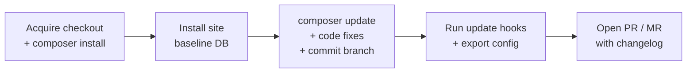

# Drupdater

> Automated, reviewable Drupal updates — as a pull/merge request, on every schedule.

[](https://github.com/drupdater/drupdater/actions/workflows/go.yml)
[](https://github.com/drupdater/drupdater/pkgs/container/drupdater-php8.3)
[](LICENSE)
[](https://github.com/drupdater/drupdater/tags)

**Drupdater** is a standalone CLI (shipped as a Docker image) that keeps Drupal
sites up to date for you. Point it at a checkout in CI; it runs `composer update`,
applies code-quality fixes, exports Drupal config, and opens a **pull request
(GitHub) or merge request (GitLab)** with a detailed, human-reviewable changelog —
security changes flagged.

You review and merge. Drupdater never deploys anything on its own.

**Who it's for:** teams maintaining one or more Drupal sites who want routine and
security updates to arrive as reviewable PRs on a schedule, instead of as a manual
chore.

> [!WARNING]
> **Project status: pre-1.0 (`v0.x`).** Drupdater is in active development and
> used in real pipelines, but the CLI surface and config format may still change
> between minor versions. Pin to a specific image tag in production.

## Contents

- [How It Works](#how-it-works)
- [Quick Start](#quick-start)
- [Prerequisites](#prerequisites)
- [CI/CD Integration](#cicd-integration)
- [Tokens & Permissions](#tokens--permissions)
- [Configuration](#configuration)
- [Run report](#run-report)
- [Troubleshooting](#troubleshooting)
- [Architecture](#architecture)
- [Development](#development)
- [Contributing](#contributing)
- [Security](#security)
- [Support](#support)
- [License](#license)

## How It Works

Drupdater runs against the checkout your CI already provides and works through
four phases in a single working directory:


```mermaid
flowchart LR
    A[Acquire checkout<br/>+ composer install] --> B[Install site<br/>baseline DB]
    B --> C[composer update<br/>+ code fixes<br/>+ commit branch]
    C --> D[Run update hooks<br/>+ export config]
    D --> E[Open PR / MR<br/>with changelog]
```

1. **Acquire** the existing checkout (or `--clone` one for local testing) and run `composer install`.
2. **Install** each Drupal site from config to build a baseline database.
3. **Update shared code** — `composer update`, code-quality fixes, patch management, then commit to a new branch.
4. **Update each site** — run database update hooks and export configuration.

Finally it pushes the branch and opens a PR/MR (skipped with `--dry-run`).

### What it does in each run

- **Dependency updates** — `composer update`, committed.
- **Security-only mode** (`--security`) — updates only packages with known vulnerabilities.
- **Patch management** — drops obsolete patches, verifies remaining ones still apply, and pulls updated patch files from Drupal.org.
- **Code style** — `phpcbf`, auto-generating a `phpcs.xml` baseline if missing.
- **Deprecation removal** — `drupal-rector`.
- **Composer hygiene** — auto-allow-lists new Composer plugins; runs `composer normalize` when `ergebnis/composer-normalize` is present.
- **Translations** — updates interface translations via Drush when `locale_deploy` is enabled.
- **Changelog** — full dependency diff table and pending DB update hooks in the PR/MR description.
- **Multi-site** — updates several sites in one repo under a single PR/MR.
- **GitHub & GitLab** — including self-hosted GitLab.

## Quick Start

Try it locally against any GitHub/GitLab repo. Pick the image matching your site's
PHP version (`php8.3`, `php8.4`, `php8.5`):

```bash
docker run ghcr.io/drupdater/drupdater-php8.3:latest \
  <token> --clone --repository-url https://github.com/you/your-drupal-site.git
```

- `<token>` — a personal access token allowed to push branches and open PRs/MRs.
- `--clone --repository-url` — tells Drupdater to fetch the repo itself. In CI you
  omit these; it uses the checkout already on disk (see below).

Add `--dry-run` to do everything except create the branch and PR/MR. In
checkout mode (no `--clone`), a `--dry-run` run touches the VCS platform for
neither reading nor writing, so it needs no token at all — omit `<token>` and
leave `DRUPDATER_TOKEN` unset.

## Prerequisites

- The site installs from configuration (`drush site-install --existing-config` works).
- The repo is hosted on GitHub or GitLab.
- **Full git history in the checkout** so the update branch can be pushed —
  `fetch-depth: 0` (GitHub Actions) or `GIT_DEPTH: "0"` (GitLab CI). Shallow
  checkouts fail with `object not found`.
- *(Optional)* A [Drupal.org GitLab access token](https://git.drupalcode.org)
  (`DRUPALCODE_ACCESS_TOKEN`) to enable patch management.

Run `drupdater check` to validate these against a checkout before scheduling a
real run — it fails fast on the first four instead of burning several minutes
on `composer install` and a site install first:

```bash
docker run -v "$(pwd)":/app -w /app ghcr.io/drupdater/drupdater-php8.3:latest check
```

By default it only runs cheap, near-instant checks (config, git history,
platform requirements, each site's `settings.php`). Add `--full` to also
clone the repo and actually run `drush site-install --existing-config` per
site — the definitive answer, at close to the cost of a real run. `check`
never modifies your checkout and exits non-zero on any failure, so it can
gate a pipeline too.

## CI/CD Integration

In CI, Drupdater runs against the checkout — no `--clone` needed. The recommended
setup is two scheduled jobs: a **weekly full update** and a **daily security-only
update**.

### GitLab CI

Run via [scheduled pipelines](https://docs.gitlab.com/ee/ci/pipelines/schedules.html).
Add a `DRUPDATER_SCHEDULE` variable per schedule to distinguish them.

```yaml
.drupdater_base:
  image:
    name: ghcr.io/drupdater/drupdater-php8.3:latest
    entrypoint: [""]
  variables:
    GIT_DEPTH: "0"  # full history required to push the update branch

drupdater:weekly:
  extends: .drupdater_base
  script:
    - /opt/drupdater/bin $DRUPDATER_TOKEN
  rules:
    - if: $CI_PIPELINE_SOURCE == "schedule" && $DRUPDATER_SCHEDULE == "weekly"

drupdater:security:
  extends: .drupdater_base
  script:
    - /opt/drupdater/bin $DRUPDATER_TOKEN --security
  rules:
    - if: $CI_PIPELINE_SOURCE == "schedule" && $DRUPDATER_SCHEDULE == "daily"
```

### GitHub Actions

**Weekly full update** (`.github/workflows/drupdater.yml`):

```yaml
name: Drupdater
on:
  schedule:
    - cron: "0 4 * * 1"   # Mondays 04:00 UTC
  workflow_dispatch:
permissions:
  contents: write
  pull-requests: write
jobs:
  drupdater:
    runs-on: ubuntu-latest
    container:
      image: ghcr.io/drupdater/drupdater-php8.3:latest
    steps:
      - uses: actions/checkout@v4
        with:
          fetch-depth: 0   # full history required to push the update branch
      - run: /opt/drupdater/bin ${{ secrets.GITHUB_TOKEN }}
```

For the **daily security update**, copy this into a second workflow file, change
the cron to `"0 4 * * *"`, and append `--security` to the run command.

## Tokens & Permissions

Drupdater needs a token that can **push branches** and **open PRs/MRs** —
except a checkout-mode `--dry-run` run, which does neither and needs no token
at all. `--clone` always needs one, dry run or not, since cloning may itself
require authentication.

| Platform | Token | Notes |
|----------|-------|-------|
| GitHub | `GITHUB_TOKEN` | Enough to push and open a PR. **But** PRs opened with `GITHUB_TOKEN` do not trigger other workflows, so CI won't run on the Drupdater PR. To get CI on the PR, use a [PAT](https://docs.github.com/en/authentication/keeping-your-account-and-data-secure/managing-your-personal-access-tokens) or [GitHub App token](https://docs.github.com/en/apps/creating-github-apps/authenticating-with-a-github-app/generating-an-installation-access-token-for-a-github-app) stored as a secret. |
| GitLab | Project/Group access token or PAT | Needs `write_repository` and `api` scope. |

## Configuration

Configuration is split in two: **CLI flags** (how a run is invoked) and
**`.drupdater.yaml`** (what the project needs, committed to the repo).

### CLI flags

All flags are optional; pass them after `<token>`, which is itself only
required for a run that clones or pushes/opens a PR/MR (see
[Tokens & Permissions](#tokens--permissions)).

| Flag | Default | Description |
|------|---------|-------------|
| `--branch` | `main` | Branch to update / MR target. Only used with `--clone`; in checkout mode the branch comes from the checkout (or the CI branch variable in detached HEAD). |
| `--working-dir` | `.` | Path to the existing checkout to update in place. |
| `--clone` | `false` | Clone instead of using the checkout. Requires `--repository-url`. For local testing. |
| `--repository-url` | _(from `origin`)_ | Repo URL. Required with `--clone`; otherwise read from the `origin` remote. |
| `--security` | `false` | Update only packages with known vulnerabilities. Selects the `run_types.security` block. |
| `--concurrency` | `GOMAXPROCS(0)` | Maximum number of sites to install/update concurrently. Site installs are as much I/O-bound as CPU-bound, so raise or lower this from the CPU-derived default to match the runner (constrained runner, slow disk, or fast NVMe with many small sites). |
| `--dry-run` | `false` | Run everything but skip pushing the branch and creating the PR/MR (the branch and commits are still created locally). In checkout mode this also means no token is required. |
| `--report` | _(disabled)_ | Write a machine-readable JSON report of the run to this path. Written on every outcome, including failures and `--dry-run`. See [Run report](#run-report). |
| `--verbose` | `false` | Debug-level logging (also logs resolved config). |
| `--config` | _(`<working-dir>/.drupdater.yaml`)_ | Path to the config file. |

### `.drupdater.yaml`

Optional file at the repo root. Missing file or omitted keys fall back to the
defaults below; unknown keys are rejected so typos fail fast.

Global keys describe the whole run; everything that differs between a normal
and a security update lives under `run_types`:

```yaml
sites: [default]      # Drupal site directories to update (must not be empty)
timeout: 30m          # overall run timeout (Go duration; 0 disables)

run_types:            # per-run-type settings; --security picks which block applies
  normal:
    addons:                      # configurable addons (mandatory ones always run)
      - code_beautifier          # phpcbf code-style fixes
      - deprecations_remover     # drupal-rector deprecation removal
      - translations_updater     # interface translations
      - composer_normalizer      # normalize composer.json
      - unsupported_modules      # report modules with no supported release
    auto_merge: false            # merge the PR/MR once its pipeline passes
  security:
    addons: []                   # minimal by default — don't interfere with the fix
    auto_merge: false
```

`--security` selects the `security` block; otherwise `normal` runs. Run
`drupdater addons` to list valid addon names.

Keying on the run type rather than on the setting means configuring a security
run is reading one stanza, instead of picking the `security` field out of every
setting in the file.

> [!NOTE]
> **Changed layout.** `addons` and `auto_merge` used to be top-level keys, each
> split by mode. They now live under `run_types.<mode>`. A config in the old
> shape fails at startup with a message showing the replacement.

#### Auto-merge

`auto_merge` is off for both run types unless you turn it on. When enabled,
drupdater asks the platform to merge the MR/PR as soon as its pipeline
succeeds — on GitLab via auto-merge, on GitHub via the repository's auto-merge
feature. Nothing is merged while checks are failing or pending; if the project
has no pipeline at all, the merge happens immediately.

The two run types are separate on purpose: auto-merging routine dependency
bumps is a different risk decision from auto-merging a security fix, and you may
well want one without the other.

Requirements and behaviour:

- **GitHub** — "Allow auto-merge" must be enabled in the repository settings,
  and the token needs write access to pull requests. drupdater picks a merge
  method the repository actually permits (merge commit, else squash, else
  rebase). Whether the branch is deleted afterwards is the repository's
  *Automatically delete head branches* setting.
- **GitLab** — the token needs the Developer role or higher. The source branch
  is deleted on merge.
- Enabling auto-merge is best-effort: if it fails (feature disabled, token
  lacks the scope, platform error) drupdater logs a warning and the run still
  succeeds. The MR/PR is left in place for you to merge by hand. The outcome is
  also recorded under `merge_request.auto_merge` in the
  [run report](#run-report), so a failure is visible to tooling and not only in
  the log.

### Environment variables

| Variable | Purpose |
|----------|---------|
| `DRUPALCODE_ACCESS_TOKEN` | Drupal.org GitLab PAT. Required for patch management (detecting upstream-committed patches and downloading updated patch files). |
| `COMPOSER_AUTH` | Composer auth JSON for private Packagist/registries. See [Composer docs](https://getcomposer.org/doc/03-cli.md#composer-auth). |

## Run report

`--report <path>` writes a JSON document describing the run. It is written on
**every** outcome — including a run that failed halfway and a `--dry-run` that
never opened a PR/MR — so a failing repository leaves behind something better
than a log to read.

```bash
drupdater --dry-run --report ./drupdater-report.json
```

```json
{
  "schema_version": 1,
  "drupdater_version": "v0.12.0",
  "started_at": "2026-07-25T02:00:00Z",
  "finished_at": "2026-07-25T02:14:31Z",
  "duration_seconds": 871.4,
  "status": "success",
  "mode": "security",
  "dry_run": false,
  "repository": "https://github.com/org/site.git",
  "base_branch": "main",
  "update_branch": "drupdater-3f81a2c",
  "merge_request": {
    "url": "https://github.com/org/site/pull/42",
    "auto_merge": { "enabled": true }
  },
  "sites": ["default"],
  "packages": [
    { "action": "Upgrade", "package": "drupal/core", "from": "10.1.8", "to": "10.2.0" }
  ],
  "phases": [
    { "name": "composer install", "started_at": "...", "duration_seconds": 63.2, "ok": true },
    { "name": "baseline site install", "started_at": "...", "duration_seconds": 121.9, "ok": true }
  ],
  "addons": {
    "composer_audit": { "fixed": [], "remaining": [] },
    "update_hooks": { "default": {} }
  }
}
```

**`status`** is one of:

| Value | Meaning |
|---|---|
| `success` | Every phase the run attempted completed. A `--dry-run` that stopped before pushing is a success. |
| `no_changes` | The run worked and found nothing to update. Reported separately so an up-to-date site isn't mistaken for a broken one. |
| `failed` | A phase returned an error. `failed_phase` and `error` say which and why. |

**`phases`** records each step with its duration, which makes the cost of a run
measurable without separate instrumentation — the phase distribution shows
whether a run is dominated by `composer install`, by site installs, or by Rector.

**`addons`** carries one structured section per addon that has something to
report (`composer_audit`, `update_hooks`, `unsupported_modules`,
`composer_patches`). Addons with nothing to say are omitted rather than present
and empty.

**`merge_request.auto_merge`** is present only when the active run type asked
for auto-merge, so "never requested" is distinguishable from "requested and
failed". A failure sets `enabled: false` and an `error` while the run itself
still reports `success` — which is exactly why it is here and not only in the
log.

Credentials never appear in the report: the repository URL is stripped of any
embedded userinfo, and the finished document passes through the same redactor
that filters the logs.

### With `drupdater check`

`--report` applies to the preflight command too, where it writes the check
results instead of a run — useful for gating a pipeline on a machine-readable
verdict:

```bash
drupdater check --report ./preflight.json
```

```json
{
  "schema_version": 1,
  "drupdater_version": "v0.12.0",
  "checked_at": "2026-07-25T02:00:00Z",
  "ok": false,
  "results": [
    { "name": "git history complete (not a shallow clone)", "ok": true },
    { "name": "site \"default\": settings.php", "ok": false, "detail": "not found at web/sites/default/settings.php" }
  ]
}
```

### Schema stability

`schema_version` is part of the contract. New fields may be added without
bumping it — **consumers must ignore unknown fields** — while removing or
renaming a field increments it.

> [!NOTE]
> While drupdater is pre-1.0, the schema may still gain fields between minor
> versions. It will not silently rename or drop them.

## Troubleshooting

| Symptom | Cause / Fix |
|---------|-------------|
| Not sure why a run would fail | Run `drupdater check` (add `--full` for the definitive site-install check) before scheduling a real run. |
| Push fails with `object not found` | Shallow checkout. Set `fetch-depth: 0` / `GIT_DEPTH: "0"`. `drupdater check` catches this upfront. |
| PR is created but CI doesn't run on it (GitHub) | Expected with `GITHUB_TOKEN` — use a PAT or App token. See [Tokens & Permissions](#tokens--permissions). |
| `composer install` fails on private packages | Provide `COMPOSER_AUTH` (see below). |
| Site install fails | Confirm `drush site-install --existing-config` works locally first. |
| Run aborts on an unknown addon name | The active addon list in `.drupdater.yaml` has a typo — `drupdater addons` lists valid names. |

<details>
<summary>Private Packagist example</summary>

```bash
docker run \
  -e COMPOSER_AUTH='{"http-basic":{"repo.packagist.com":{"username":"token","password":"<your-token>"}}}' \
  ghcr.io/drupdater/drupdater-php8.3:latest \
  <token> --clone --repository-url <repository_url>
```
</details>

<details>
<summary>Updating multiple sites in one repository</summary>

**1.** Resolve the active site directory from the `SITE_NAME` env var in
`web/sites/sites.php` (or a file it includes):

```php
$site_name = getenv('SITE_NAME');
if (is_string($site_name) && $site_name !== "") {
  $scheme = $request->getScheme();
  $port = $request->getPort();
  $site = $request->getHost();
  if ($site !== '') {
    if (('http' === $scheme && 80 != $port) || ('https' === $scheme && 443 != $port)) {
      $site = $port . '.' . $site;
    }
    if (!isset($sites[$site])) {
      $sites[$site] = $site_name;
    }
  } else {
    $sites[str_replace('/', '.', dirname($script_name))] = $site_name;
  }
}
```

**2.** List each site directory under `sites` in `.drupdater.yaml`:

```yaml
sites: [default, subsite_a, subsite_b]
```

All sites are updated in one branch under a single PR/MR.
</details>

## Architecture

Drupdater is a Go CLI (Cobra) that orchestrates external tools (Composer, Drush,
PHPCBF, Rector) over a linear, event-driven workflow. Functionality is organized
as **addons** subscribed to workflow events. For the full breakdown — workflow
phases, the addon system, and the VCS provider abstraction — see
[`CLAUDE.md`](CLAUDE.md).

## Development

Requires Go 1.26+ and `make`.

```bash
make build   # build the binary
make test    # run all tests
make lint    # vet + staticcheck + golangci-lint
make fmt     # format
make mock    # regenerate mocks (mockery v3)
```

Run a single test:

```bash
go test -v -run TestName ./path/to/package/...
```

## Contributing

Contributions are welcome. Please open an issue to discuss substantial changes
before opening a PR, run `make lint test` before submitting, and keep PRs
focused. See [`CONTRIBUTING.md`](CONTRIBUTING.md) for details.

## Security

Drupdater handles credentials and modifies dependency trees, so we take security
seriously. **Do not file public issues for vulnerabilities.** Report them
privately via [GitHub Security Advisories](https://github.com/drupdater/drupdater/security/advisories/new)
or the contacts in [`SECURITY.md`](SECURITY.md).

## Support

- **Bugs / features:** [GitHub Issues](https://github.com/drupdater/drupdater/issues)
- **Questions / ideas:** [GitHub Discussions](https://github.com/drupdater/drupdater/discussions)

## License

Licensed under the [Apache License 2.0](LICENSE).
