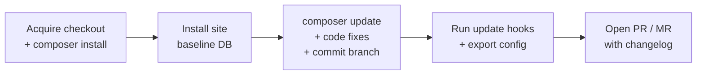

# How a run works

Drupdater operates on a **single working directory** — the checkout your CI already
provides, or a fresh clone with `--clone`. Old and new code live there sequentially. There
is no second copy and no side-by-side comparison.

## The seven phases

Phases run linearly. Their names are exactly the strings that appear in the [run
report](../reference/run-report.md)'s `phases` list.

### 1. `acquire working copy`

Opens the existing checkout, or clones into a temporary directory with `--clone`.

This is a recorded phase rather than setup because a bad token, an unreachable host or an
unreadable checkout is one of the most common real failures — and a failure here should be
as visible in the report as one during the update itself.

### 2. `preflight`

Runs two checks: full git history, and PHP platform requirements. These are the same
functions [`drupdater check`](../reference/cli/check.md) uses, so a shallow checkout is
caught identically in both.

They run here — before anything expensive — because both failures are certain rather than
probable. A shallow checkout *will* fail at push time, several minutes later, with a
message that does not mention shallowness.

### 3. `composer install`

Installs the current dependency tree, establishing the "before" state.

### 4. `baseline site install`

Installs each configured site via Drush, at the **old** code, building a baseline
database.

This is what makes the update hooks in phase 6 meaningful. Running `updatedb` requires a
database at the pre-update schema; without a baseline there would be nothing for the
hooks to update, and no way to discover which hooks the update introduces.

Sites are installed concurrently, limited by `--concurrency`.

### 5. `update shared code`

The centre of the run:

1. Create and check out a throwaway work branch, `drupdater-work-<timestamp>`.
2. Fire **`pre-composer-update`**. Addons mutate the event to steer what follows —
   [`composer_audit`](../reference/addons/composer-audit.md) restricts the update to
   vulnerable packages; [`composer_patches`](../reference/addons/composer-patches.md) pins
   packages whose patches cannot be made to apply.
3. Run `composer update` with those constraints. **If nothing changed, the run aborts
   here** — reported as `no_changes`, exit `0`.
4. Fire **`post-composer-update`** — the dependency diff and normalisation.
5. Commit `composer.json` and `composer.lock`.
6. Fire **`post-code-update`** — Rector, PHPCBF, and the post-update security audit.
7. Compute the final branch name from a hash of the resulting `composer.lock`, and check
   it does not already exist.
8. Check out that branch from the work branch's tip.

The work branch has a flat name rather than `drupdater/work-…` deliberately: a repository
containing a branch literally named `drupdater` would make `refs/heads/drupdater` a file,
blocking any nested ref beneath it.

### 6. `site update`

Per site, concurrently: configure the database, fire **`pre-site-update`**, run the update
hooks, resave configuration, fire **`post-site-update`**, and export configuration.

The commit step is serialised across sites even though the rest is concurrent. All sites
share one worktree and one git index, and `drush config:export` shells out to git itself —
so concurrent commits would race on the index.

### 7. `publish`

**Skipped entirely under `--dry-run`.**

Push the branch, generate the description from every addon's template, fire
**`pre-merge-request-create`** (where a security run retitles the request), and create it.

If creating the request fails after the push succeeded, the just-pushed remote branch is
deleted on a best-effort basis — otherwise a failed run would leave an orphan branch that
the next run's name check would then trip over.

Finally, if the active run type asks for it, auto-merge is requested. A failure here is
logged and recorded but does not fail the run.

## Content-addressed branch names

The update branch is named `update-<hash>`, where the hash comes from the resulting
`composer.lock`.

This makes the name a function of the *outcome*, not of the time. Two runs that produce
identical dependencies produce the same branch name — so the second one detects the branch
already exists and aborts rather than opening a duplicate request.

## "Nothing to do" is a success

Three conditions stop a run early, and all three exit `0`:

| Condition | Message |
|---|---|
| `composer update` changed nothing | `no changes detected` |
| The update branch already exists | `branch update-… already exists` |
| A `--security` run found no advisories | `No security advisories found` |

Internally these raise an abort signal that is logged as a warning rather than an error,
and sets the report's `status` to `no_changes`.

The alternative — treating them as failures — would mean a nightly security job on a
healthy site goes red every night, which trains everyone to ignore it.

## Failure and cleanup

Every run registers its cleanup before it starts work, so it runs on every exit path
including a timeout or `SIGTERM`.

**The report is written last.** Its deferred write is registered first, which in Go means
it runs last — so the report reflects everything that happened, including failures during
other cleanup.

**A failed run restores the original checkout.** The captured HEAD is force-checked-out,
discarding stray commits on the work branch and — importantly — any `allow-plugins: true`
that [`composer_allow_plugins`](../reference/addons/composer-allow-plugins.md) left in
`composer.json`. Errors during restore are logged but never returned: they must not mask
the original failure.

**Site artefacts are removed.** In checkout mode, each `<site>.sqlite` and
`private/<site>` beside the working directory, then `private/` itself — which only
succeeds if empty, which is exactly the desired guard. A project's real private files
directory survives.

In clone mode the whole temporary directory is removed, guarded by a check that it really
is inside the system temp directory.

## Concurrency

Per-site work fans out with a limit of `--concurrency`, defaulting to `GOMAXPROCS(0)` —
which reflects the container's CPU quota rather than the host's core count.

The first site to fail cancels the rest. Sites are not updated independently; the point is
a single coherent request covering all of them.
