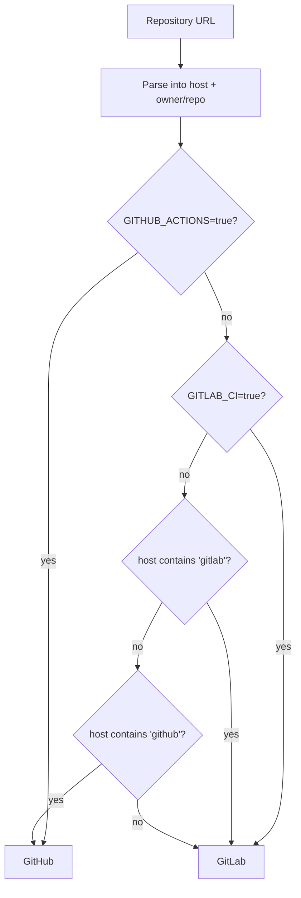

# VCS provider detection

Drupdater supports GitHub and GitLab. It has no configuration option for which one you are
using — it works it out.

## The decision order



### 1. Parse the URL

Both HTTP(S) and SCP-style forms are accepted:

```text
https://github.com/org/site.git
git@gitlab.example.com:org/site.git
```

SCP-style URLs are handled explicitly rather than via a URL parser, because a strict parser
rejects `git@host:owner/repo.git` — even though cloning and provider detection handle it
perfectly well. That is also why `--repository-url` is validated against this parser rather
than a stricter one.

### 2. Environment override

`GITHUB_ACTIONS=true` forces GitHub; `GITLAB_CI=true` forces GitLab. Both platforms set
these automatically in their own CI.

This step is **authoritative** and comes before hostname inspection, which is what makes a
self-hosted instance on an arbitrary domain work with no configuration at all. If you are
running inside GitLab CI, the repository is on that GitLab, whatever it is called.

### 3. Hostname substring

Failing that, the **host** is matched case-insensitively against `gitlab`, then `github`.

Only the host, not the whole URL. Matching the full URL would misroute
`github.com/acme/gitlab-migration` to GitLab on the strength of the repository name.

### 4. GitLab is the fallback

Any host that matches neither resolves to **GitLab**.

This is not arbitrary. Self-hosted GitLab is common and its hostnames are arbitrary
(`code.acme.internal`, `git.example.org`); self-hosted GitHub Enterprise is rarer, and its
API surface differs from github.com in ways Drupdater does not currently handle. Defaulting
to GitLab makes the common unrecognised case work by itself.

The GitLab client is constructed with the parsed host as its base URL, so a self-hosted
instance needs nothing beyond a working token.

## GitHub Enterprise is not supported

The GitHub client always targets github.com. There is no base-URL configuration.

Even if there were, [auto-merge](../how-to/enable-auto-merge.md) would not work: it uses
GitHub's GraphQL API at a path that GitHub Enterprise serves outside its REST prefix, and
that path is hardcoded.

A GitHub Enterprise host that does not contain `github` in its name will fall through to
the GitLab client and fail with an unhelpful error. This is a genuine gap rather than a
deliberate exclusion.

## What the platform abstraction covers

Both implementations satisfy one small interface:

| Operation | Purpose |
|---|---|
| Create a merge/pull request | The output of a run |
| Delete a branch | Cleanup when creating the request fails after the push succeeded |
| Get the authenticated user | The commit author identity |
| Enable auto-merge | Optional, best-effort |

Deliberately absent: merging, deploying, force-pushing, closing requests, commenting.
Drupdater's contract with your repository is "add a branch, open a request", and the
interface is scoped so nothing more is even reachable. See [What Drupdater does not
do](non-goals.md).

## Where the platforms genuinely differ

Most of the abstraction is symmetric. Two places are not, and both are visible in
behaviour:

**Auto-merge on GitHub** requires the repository's "Allow auto-merge" setting, and
Drupdater must pick a merge method the repository permits — trying merge commit, then
squash, then rebase. Whether the branch is deleted afterwards is the repository's own
setting.

**Auto-merge on GitLab** requires waiting for the merge request's status to settle first.
GitLab reports a request as "preparing" or "checking" for a while after creation, and
requesting auto-merge too early fails. Drupdater polls briefly, and retries the accept call
on the specific error that means "cannot merge yet" — which covers both a genuine blocker
and a transient race. It deliberately does **not** wait for the request to become
mergeable: "CI must pass" is precisely the state auto-merge exists to handle. The GitLab
source branch is always deleted on merge.
